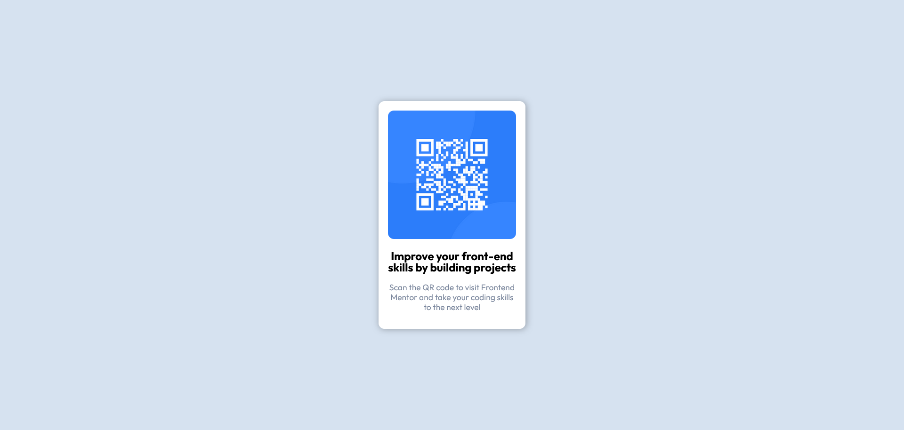

# Frontend Mentor - QR code component solution

This is a solution to the [QR code component challenge on Frontend Mentor](https://www.frontendmentor.io/challenges/qr-code-component-iux_sIO_H). Frontend Mentor challenges help you improve your coding skills by building realistic projects. 

## Table of contents

- [Overview](#overview)
  - [Screenshot](#screenshot)
  - [Links](#links)
- [My process](#my-process)
  - [Built with](#built-with)
  - [What I learned](#what-i-learned)
- [Author](#author)
- [Acknowledgments](#acknowledgments)

**Note: Delete this note and update the table of contents based on what sections you keep.**

## Overview

This is a simple webpage of QR code which is at the center of the page. There are some flex items and some and aligned justified using the properties. This is a very basic project 

### Screenshot




### Links

- Live Site URL: [https://zesty-zabaione-7f9f6b.netlify.app/]

## My process
This is a basic webpage design. I find it challanging while doing the project at first becausse i am a beginner to webdesigning. Any way it got easier when i started doing it. 
### Built with

- Semantic HTML5 markup
- CSS custom properties
- Flexbox


### What I learned

I have learned some more advantages of the flex box. It was easier to do basic alignment and justifiying the content. It was easier for me to make the QR code and the content in the center of the page. I have used the height for the main container as 100vh and gave the 'justify' and 'align' to center for the qr container.
I have alson made the width of the 'qr container' to 250 px for making the width of the qr container as in the project image

To see how you can add code snippets, see below:

```html
<section id="qr-code">
    <div class="container">
      <div class="qr-container">
        <div class="qr-image">
          
        </div>
        <div class="qr-content">
          <h1>Improve your front-end skills by building projects</h1>
          <p>Scan the QR code to visit Frontend Mentor and take your coding skills to the next level</p>
        </div>
      </div>
    </div>
  </section>
```
```css
 :root {
      --white: hsl(0, 0%, 100%);
      --light-grey: hsl(212, 45%, 89%);
      --grayish-blue: hsl(220, 15%, 55%);
      --dark-blue: hsl(218, 44%, 22%);
    }

    * {
      padding: 0;
      margin: 0;
      box-sizing: border-box;
    }

    body {
      font-family: 'Outfit', sans-serif;
      line-height: 1.2;
      background: var(--light-grey);
    }

    .container {
      display: flex;
      align-items: center;
      justify-content: center;
      max-width: 1100px;
      margin: 0 auto;
      height: 100vh;
      padding: 0 10px;
    }

    .qr-container {
      display: flex;
      flex-direction: column;
      align-items: center;
      justify-content: center;
      padding: 1rem 1rem 1.8rem 1rem;
      background: var(--white);
      color: black;
      text-align: center;
      width: 250px;
      border-radius: 10px;
      box-shadow: 1px 1px 10px rgba(0, 0, 0, 0.3);

    }

    .qr-container .qr-image {
      display: inline-block;
      width: 100%;
      border-radius: 10px;
    }

    .qr-container .qr-content h1 {
      font-size: 1.2rem;
      line-height: 1.2rem;
      padding: 1rem 0;
      font-weight: 700;
    }

    .qr-container .qr-content p {
      font-size: 14px;
      color: var(--grayish-blue);
      font-weight: 400;
    }


    .attribution {
      font-size: 11px;
      text-align: center;
    }

    .attribution a {
      color: hsl(228, 45%, 44%);
    }

```


## Author

- Website - [mishal musthafa](https://mishalmusthafa.netlify.app/)
- Frontend Mentor - [@mishalmusthafa](https://www.frontendmentor.io/profile/mishalmusthafa)


## Acknowledgments

I have learned the basics of the HTML and CSS from Brad Traversy on udemy. Which helped me a lot on this project. He got many helpfull courses on udemy and also in the youtube for free. He is an excenllent tutor. Please check it out if you are a beginner to the webdevelopment


